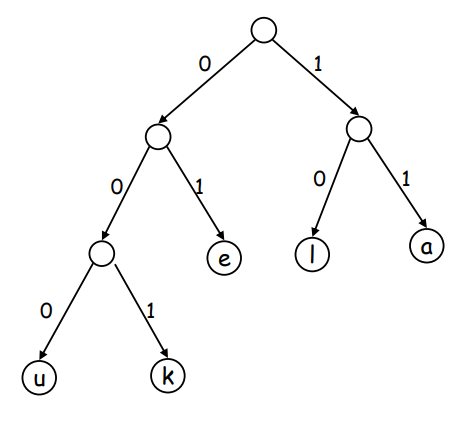
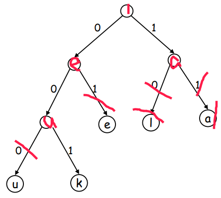

# Problem

Normally, the character encodings are length fixed, such as ascii which always has 8 bits. Is there a way to compress the encoding?

## Prefix

 The direct thought is to use less length to encode. Such as a to be 0 and b to be 1. But then come to the problem that how to represent c. 0 and 1 are occupied. How about using 10? As there’s no separator in dram for encoding, the code for abc is 0110. The first bit represent a, the second is b,  the problem is the left two bits. Are they representing c or representing ba? You can never know unless you ask the author.

So to solve this problem, we have a principle to ensure that **no code is a prefix of another one**. In our example, b become the prefix of c, so it’s wrong. We can try a be 01, b be 10, c be 11. Then abc is 011011, which can be easily translate with no error.

---

Then, the problem is how to determine the encoding. Here, we can use binary tree.

## Binary tree

For every node in a binary tree, it can only has two child, left or right. So we can represent them as 0 and 1. Then we can use the path to a certain node as code. For example,

In this picture, we can represent the left-most node u as 000 and right-most node l as 10.

Actually, this picture has gone too far. Let’s step back. If we represent a char in a node like

Please ignore my bad drawing. In this tree, the first problem is that there’s no code represent l. And the code for u is 00 and k is 001. Then when we have 0010..., are we treat it as ke or uae? It’s vagued.

We choose to represent the char in the leafs. Then, there will be no char in the ancestors of node(leaf). And apparently no other char has the prefix encoding of each char.

---

Now, we have set the data structure to be Binary tree. What’s next? How can we find the optimal encodings? Let’s explore it.